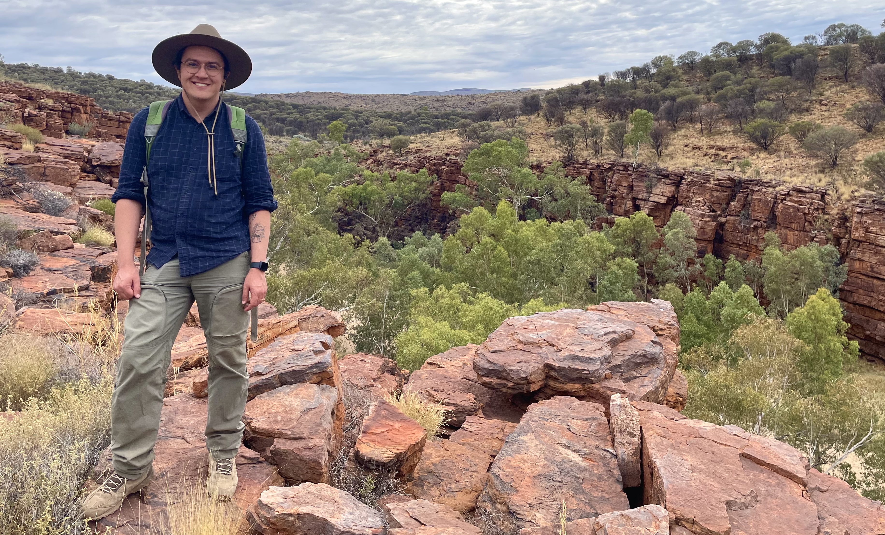

# G'Day, I'm Ryan.



I'm a mycologist, botanist, and evolutionary biologist. I'm currently working as a postdoctoral research officer with the Linde Group at the Australian National University (ANU) in Canberra. I was awarded my PhD in 2026 for my thesis entitled *Understanding Australian Orchids & Their Mycorrhizal Fungi – Macro to Microevolutionary Perspectives*. My current research is focused on investigating the evolution of the Australian orchid flora and its associated funga. I am also investigating species level questions in *Rhizoctonia* (Ceratobasidiaceae).

More broadly, I have interests in systematics, taxonomy, species delimitation, and evolutionary ecology—particularly with respect to the evolution of symbiosis. Prior to starting my PhD, I completed my Master of Scientific Studies (Biodiversity Science) as a Vice-Chancellor's Scholar at the University of New England (UNE), where I was awarded the N.C.W. Beadle Scholarship in Botany to complete my Masters research project on the taxonomy, systematics, and conservation of *Prostanthera* (Lamiaceae).

Prior to becoming a scientist, I worked as an opera singer, voice actor, film maker, and writer. I have performed and had my films screened nationally and internationally, and I have won multiple prizes and scholarships for my work.

Rather than shy away from my unconventional career trajectory, I've decided to embrace it and acknowledge the diversity of experiences and skills that I have. With my background in stage, media, and communications, I have been able to translate these skills to communicate complex ideas with non-specialist audiences in an engaging way. I am a keen science communicator and educator, and I am passionate about storytelling with science.
